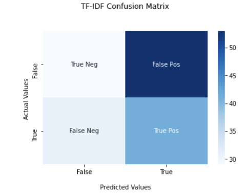
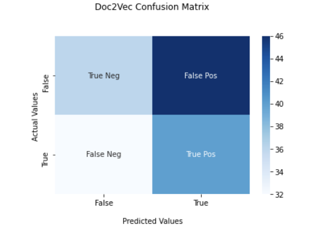

## 1. Training Set Results

Among 1200 abstracts, 40% (487/1200) were effectively big data related. The term matching provide a precision to classify abstracts into big data and non big data by ((557+444)/1200 = 83.4%) Most of the error from the term-matching in labeling is to classify an abstract that is non big data related as big data based on the name (156/713) 21.8%.

{width=75% }

There was no high difference in labeling between experts. In overall, 79.3% ((64+32)/121) of abstracts have been identically labelled by the 02 experts. Most of the assigning difference is from assigning a non big-data abstracts as big-data.  

{width=75% }

## 2. KNN Performance on Test Set
Below are confusion matrices that were created from testing the labeled data on a trained KNN classifier. As can be seen by the matrices above, both vectorization methods had a fairly large amount of false positives. This could be an explanation for the large number of abstracts that were identified as big data.  

{width=40% }
{width=40% }   

## 3. KNN on Full Corpus : Big Data Corpus 
257,123 abstracts were identified using TF-IDF to vectorize the text and KNN to classify it. 484,362 abstracts were identified using Doc2Vec to vectorize the text with the KNN classifier as well. The distribution of funding over time and by agency were calculated.  
{width=40% }
{width=40% }
  
Through vectorizing the abstracts in our corpus and using a classification method, it was possible to identify whether abstracts were related to big data. Once these abstracts were identified, topic models were run on them to further identify sub-theme trends.  

## 4. Trends  

### 4.1 NMF with 10 Topics  

   

   

### 4.2 NMF with 20 Topics   
  
    
    
### 4.3 NMF with 30 Topics   

